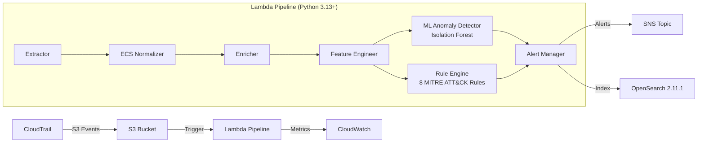

# CloudSentinel Zero-Trust

> **Enterprise-grade AWS SIEM with ML-powered anomaly detection — runs locally or deploys to AWS Free Tier.**

[](https://www.python.org/downloads/)
[](LICENSE)
[]()
[]()
[]()

---

## Table of Contents

- [Overview](#overview)
- [Key Features](#key-features)
- [Architecture](#architecture)
- [Pipeline Flow](#pipeline-flow)
- [Detection Rules](#detection-rules)
- [ML Feature Vector](#ml-feature-vector)
- [Technology Stack](#technology-stack)
- [Project Structure](#project-structure)
- [Prerequisites](#prerequisites)
- [Installation](#installation)
- [Configuration](#configuration)
- [Environment Variables](#environment-variables)
- [Usage](#usage)
- [Developer Commands](#developer-commands)
- [AWS Deployment](#aws-deployment)
- [OpenSearch Setup](#opensearch-setup)
- [Monitoring](#monitoring)
- [Testing](#testing)
- [Security Scanning](#security-scanning)
- [Attack Simulation](#attack-simulation)
- [Troubleshooting](#troubleshooting)
- [Contributing](#contributing)
- [License](#license)

---

## Overview

CloudSentinel Zero-Trust is a security information and event management (SIEM) system designed for AWS environments. It ingests AWS CloudTrail logs, normalizes them to Elastic Common Schema (ECS) 8.10+, and applies dual detection: **8 deterministic rules** mapped to MITRE ATT&CK and an **Isolation Forest ML model** for anomaly detection (AUC-ROC 0.9992, FPR < 0.6%).

The system runs in two modes:

- **Local Mode**: Full pipeline without AWS credentials — processes real CloudTrail JSON exports from your filesystem.
- **AWS Mode**: Lambda-triggered pipeline with S3, SNS, OpenSearch, and CloudWatch integration.

---

## Key Features

| Feature | Details |
|---------|---------|
| **Zero-Trust Detection** | 8 deterministic rules mapped to MITRE ATT&CK framework |
| **ML Anomaly Detection** | Isolation Forest · AUC-ROC 0.9992 · FPR < 0.6% |
| **ECS Normalization** | CloudTrail → Elastic Common Schema 8.10+ with `cloudsentinel.*` namespace |
| **Real-time Alerting** | SNS notifications with 5-min SHA-256 deduplication window |
| **Campaign Correlation** | Groups related alerts within 5-min window per user |
| **OpenSearch Indexing** | Daily rolling indices with bulk ingestion and circuit breaker |
| **Local Mode** | Full pipeline runs without AWS credentials |
| **AWS Free Tier** | Entire stack runs within free-tier limits |
| **Dual Detection** | Rule engine + ML anomaly detector run in parallel |
| **Feature Importance** | Per-sample contributing features via score perturbation |
| **Structured Logging** | JSON logs with correlation IDs via `structlog` + `rich` |
| **12-Factor Config** | Pydantic v2 `BaseSettings` → env vars → SSM Parameter Store → defaults |

---

## Architecture



### AWS Resources

| Resource | Purpose | Free Tier |
|----------|---------|-----------|
| Lambda | Pipeline compute (Python 3.13+) | 1M requests/month |
| S3 | CloudTrail log storage + model artifacts | 5 GB |
| OpenSearch | Event indexing and dashboards | 750 hrs/month (t2.micro) |
| SNS | Alert notifications | 1M publishes/month |
| CloudWatch | Metrics, dashboards, alarms | 10 custom metrics |
| SSM Parameter Store | Configuration management | Free tier |
| CloudTrail | Audit log source | 1 trail free |

---

## Pipeline Flow

The pipeline executes 8 stages, each with explicit error handling:

```
┌─────────┐   ┌────────────┐   ┌─────────┐   ┌──────────────────┐
│ Extract │──▶│ Normalize  │──▶│ Enrich  │──▶│ Feature Engineer │
│ (S3/FS) │   │ (CloudTrail│   │ (Geo,   │   │ (10-dim vector)  │
│         │   │  → ECS)    │   │  Risk)  │   │                  │
└─────────┘   └────────────┘   └─────────┘   └────────┬─────────┘
                                                       │
                                               ┌───────┴───────┐
                                               ▼               ▼
                                        ┌────────────┐  ┌────────────┐
                                        │ ML Detector│  │ Rule Engine│
                                        │ (IsoForest)│  │ (8 Rules)  │
                                        └─────┬──────┘  └─────┬──────┘
                                              │               │
                                              └───────┬───────┘
                                                      ▼
                                               ┌────────────┐
                                               │   Alert    │
                                               │  Manager   │
                                               └─────┬──────┘
                                                     │
                                               ┌─────┴──────┐
                                               ▼            ▼
                                        ┌──────────┐  ┌──────────┐
                                        │   SNS    │  │ OpenSearch│
                                        │ Dispatch │  │  Ingest   │
                                        └──────────┘  └──────────┘
```

**Local Mode** replaces S3 with filesystem reads and SNS with stdout + JSONL file output.

---

## Detection Rules

| Rule ID | Name | Severity | MITRE Technique | MITRE Tactic |
|---------|------|----------|----------------|--------------|
| RULE-001 | Root Account Usage | Critical | T1078.004 | Privilege Escalation |
| RULE-002 | IAM Privilege Escalation | High | T1098 | Privilege Escalation |
| RULE-003 | CloudTrail Tampering | Critical | T1562.008 | Defense Evasion |
| RULE-004 | Security Group Modification | Medium | T1562.007 | Defense Evasion |
| RULE-005 | Sensitive API from External IP | High | T1078 | Initial Access |
| RULE-006 | Console Login Without MFA | High | T1078.004 | Initial Access |
| RULE-007 | S3 Bucket Policy Change | Medium | T1537 | Exfiltration |
| RULE-008 | Cross-Account Access | Medium | T1550.001 | Lateral Movement |

**Alert Severity Logic:**
1. Start with maximum rule severity
2. Boost by one level if anomaly score >= 80
3. Boost by one level if >= 3 rules triggered
4. Cap at `critical`

---

## ML Feature Vector

The Isolation Forest model uses a 10-dimensional normalized feature vector:

| # | Feature | Range | Description |
|---|---------|-------|-------------|
| 0 | `hour_of_day_normalized` | [0, 1] | UTC hour / 23 |
| 1 | `day_of_week_normalized` | [0, 1] | Day-of-week / 6 |
| 2 | `is_weekend` | {0, 1} | Weekend flag |
| 3 | `source_geo_risk_score` | [0, 1] | IP geolocation risk score |
| 4 | `api_call_risk_score` | [0, 1] | API sensitivity classification |
| 5 | `is_root_user` | {0, 1} | Root account flag |
| 6 | `is_cross_region` | {0, 1} | Activity outside home region |
| 7 | `failed_auth_velocity` | [0, 1] | Recent failed-auth rate (proxy) |
| 8 | `api_entropy_1h` | [0, 1] | API call diversity signal (proxy) |
| 9 | `privilege_escalation_score` | [0, 1] | Privilege escalation signal |

**Training:** Synthetic labeled data generated via `ml/training/generate_synthetic_data.py`, trained with `ml/training/train_model.py`. Model artifact: `ml/data/local/models/isolation_forest/model.joblib`.

**Hyperparameters:** `n_estimators=200, contamination=0.1, max_samples='auto', random_state=42`

---

## Technology Stack

| Component | Technology | Version |
|-----------|-----------|---------|
| Language | Python | 3.13+ |
| Data Validation | Pydantic | v2 |
| Settings | pydantic-settings | 2.1+ |
| ML | scikit-learn | 1.4+ |
| Serialization | joblib | 1.3+ |
| AWS SDK | boto3 | 1.34+ |
| OpenSearch | opensearch-py | 2.4+ |
| Terminal UI | rich | 13+ |
| Testing | pytest + moto | 8.0+ / 5.0+ |
| Linting | Ruff | 0.3+ |
| Type Checking | mypy + pyright | 1.8+ / 1.1.390+ |
| Security | Bandit | 1.7+ |
| IaC | CloudFormation | — |

---

## Project Structure

```
cloudsentinel-zero-trust/
├── cloudsentinel.py                  # Single entry point (interactive + CI/CD)
├── src/                              # Lambda pipeline source code
│   ├── lambda_handler.py             # AWS Lambda entry point (S3 trigger)
│   ├── models/                       # Pydantic v2 data models
│   │   ├── cloudtrail_event.py       # Raw CloudTrail event model
│   │   └── ecs_event.py              # ECS 8.10+ normalized event model
│   ├── pipeline/                     # Detection pipeline stages
│   │   ├── extractor.py              # Download & parse CloudTrail from S3
│   │   ├── normalizer.py             # CloudTrail → ECS schema mapping
│   │   ├── enricher.py               # Geo-lookup, IP classification, risk scoring
│   │   ├── feature_engineer.py       # 10-dim feature vector extraction
│   │   ├── ingester.py               # OpenSearch bulk indexing
│   │   └── runner.py                 # LocalPipelineRunner (no AWS)
│   ├── detectors/                    # Detection engines
│   │   ├── rule_engine.py            # 8 MITRE ATT&CK rules
│   │   ├── anomaly_detector.py       # Isolation Forest inference
│   │   └── alert_manager.py          # Dedup, correlation, SNS dispatch
│   ├── integrations/                 # External service clients
│   │   ├── s3_client.py              # S3 / LocalS3Client (filesystem)
│   │   ├── sns_client.py             # SNS / LocalSNSClient (stdout+JSONL)
│   │   └── opensearch_client.py      # OpenSearch connection factory
│   └── utils/                        # Shared utilities
│       ├── config.py                 # Pydantic Settings + SSM integration
│       ├── logger.py                 # Structured JSON logger (structlog)
│       └── exceptions.py             # Custom exception hierarchy
├── ml/
│   ├── data/                         # Datasets + trained model
│   │   ├── local/models/             # Local model storage
│   │   └── cloudtrail_samples/       # CloudTrail JSON exports (user-provided)
│   └── training/                     # ML training scripts
│       ├── generate_synthetic_data.py # Synthetic labeled data generator
│       ├── train_model.py            # Isolation Forest training
│       ├── evaluate_model.py         # ROC-AUC, precision/recall evaluation
│       ├── hyperparameter_tuning.py  # Grid search optimization
│       └── model_registry.py         # Model versioning and metadata
├── infrastructure/
│   └── cloudformation/               # IaC templates
│       ├── main.yaml                 # Root stack (VPC, Lambda, S3, SNS, OpenSearch)
│       └── lambda-pipeline.yaml      # Lambda function + IAM roles
├── opensearch/
│   ├── indices/                      # Index mappings (events, alerts)
│   ├── dashboards/                   # Saved queries and visualizations
│   └── setup/                        # Index creation scripts
├── monitoring/
│   ├── cloudwatch_dashboards.yaml    # 14-widget operational dashboard
│   └── alarms.yaml                   # 6 critical alarms (CloudFormation)
├── tools/
│   ├── attack_simulator.py           # 3 attack scenarios for detection testing
│   ├── detection_validator.py        # Post-attack MTTD/FPR validation
│   └── alerts/                       # Local alert JSONL files
├── tests/
│   ├── unit/                         # 59 unit tests (pytest + moto)
│   ├── integration/                  # End-to-end pipeline tests
│   ├── fixtures/                     # Real CloudTrail event fixtures
│   └── conftest.py                   # Shared test fixtures
├── scripts/
│   └── local_demo.sh                 # One-command setup script
├── .env.example                      # AWS deployment config template
├── .env.local                        # Local mode config (no AWS needed)
├── requirements.txt                  # Production dependencies
├── requirements-dev.txt              # Dev + test dependencies
├── Makefile                          # Developer commands
├── pyrightconfig.json                # Pyright type checker config
└── LICENSE                           # MIT License
```

---

## Prerequisites

- **Python 3.13+**
- **AWS CLI** (for deployment only — not required for local mode)
- **Docker** (for OpenSearch — optional)

---

## Installation

### Local Mode (No AWS Required)

```bash
# Clone the repository
git clone https://github.com/your-org/cloudsentinel-zero-trust.git
cd cloudsentinel-zero-trust

# Create virtual environment
python3 -m venv .venv
source .venv/bin/activate

# Install dependencies (includes dev/test tools)
pip install -r requirements-dev.txt

# Configure local environment
cp .env.local .env
export $(grep -v '^#' .env.local | xargs)
```

### AWS Deployment

```bash
# Copy and configure environment
cp .env.example .env
# Edit .env with your AWS account details

# Install production dependencies
pip install -r requirements.txt

# Package Lambda
make package
```

---

## Configuration

### 12-Factor App Design

CloudSentinel uses Pydantic v2 `BaseSettings` with the following resolution order:

1. **Environment variables** (highest priority)
2. **AWS SSM Parameter Store** (skipped in local mode)
3. **Default values** (lowest priority)

All settings use the `CLOUDSENTINEL_` prefix.

---

## Environment Variables

### Core

| Variable | Default | Description |
|----------|---------|-------------|
| `CLOUDSENTINEL_ENVIRONMENT` | `local` | Environment name (`local`, `dev`, `prod`) |
| `CLOUDSENTINEL_LOCAL_MODE` | `true` | Skip AWS services; use filesystem + stdout |
| `CLOUDSENTINEL_LOG_LEVEL` | `INFO` | Logging level (`DEBUG`, `INFO`, `WARNING`, `ERROR`, `CRITICAL`) |
| `CLOUDSENTINEL_SSM_PREFIX` | `/cloudsentinel/local` | SSM parameter path prefix |

### OpenSearch

| Variable | Default | Description |
|----------|---------|-------------|
| `CLOUDSENTINEL_OPENSEARCH_ENDPOINT` | `http://localhost:9200` | OpenSearch HTTP endpoint |
| `CLOUDSENTINEL_OPENSEARCH_INDEX_PREFIX` | `cloudsentinel` | Index name prefix |
| `CLOUDSENTINEL_OPENSEARCH_BATCH_SIZE` | `100` | Bulk API batch size (1–5000) |

### SNS

| Variable | Default | Description |
|----------|---------|-------------|
| `CLOUDSENTINEL_SNS_TOPIC_ARN` | `arn:aws:sns:local:...` | SNS topic ARN for alerts |

### ML Model

| Variable | Default | Description |
|----------|---------|-------------|
| `CLOUDSENTINEL_MODEL_BUCKET` | `local` | S3 bucket for ML models |
| `CLOUDSENTINEL_MODEL_KEY` | `models/isolation_forest/model.joblib` | S3 key for model artifact |
| `CLOUDSENTINEL_ANOMALY_THRESHOLD` | `65` | Anomaly score threshold (0–100) |

### Alert

| Variable | Default | Description |
|----------|---------|-------------|
| `CLOUDSENTINEL_ALERT_COOLDOWN_MINUTES` | `5` | Alert deduplication cooldown window |

### AWS

| Variable | Default | Description |
|----------|---------|-------------|
| `CLOUDSENTINEL_AWS_REGION` | `us-east-1` | AWS region |
| `AWS_ACCESS_KEY_ID` | `test` | AWS access key (local mode dummy) |
| `AWS_SECRET_ACCESS_KEY` | `test` | AWS secret key (local mode dummy) |
| `AWS_DEFAULT_REGION` | `us-east-1` | AWS default region |

### Local Paths

| Variable | Default | Description |
|----------|---------|-------------|
| `CLOUDSENTINEL_LOCAL_DATA_DIR` | `ml/data` | Root directory for local model + data |
| `CLOUDSENTINEL_LOCAL_ALERTS_DIR` | `tools/alerts` | Directory for local alert JSONL files |
| `CLOUDSENTINEL_LOCAL_EVENTS_DIR` | `ml/data/cloudtrail_samples` | Directory with CloudTrail sample files |

---

## Usage

### Interactive CLI Menu

```bash
# Load local environment
export $(grep -v '^#' .env.local | xargs)

# Launch interactive menu
python cloudsentinel.py
# or
make run
```

The interactive menu provides:

| Option | Action | Description |
|--------|--------|-------------|
| 1 | Setup & Train ML Model | Generate synthetic data and train Isolation Forest |
| 2 | Analyze CloudTrail Events | Run full detection pipeline on local CloudTrail files |
| 3 | View Recent Alerts | Display alerts from last pipeline run |
| 4 | Evaluate Model Performance | Compute ROC-AUC, precision/recall, confusion matrix |
| 5 | Run Test Suite | Execute all 59 unit tests |
| 6 | System Status | Show model, events, alerts, and mode status |
| 0 | Exit | Quit CloudSentinel |

### Non-Interactive (CI/CD) Mode

```bash
python cloudsentinel.py --no-menu --train          # Train ML model
python cloudsentinel.py --no-menu --run-pipeline   # Run detection pipeline
python cloudsentinel.py --no-menu --run-tests      # Run test suite
python cloudsentinel.py --no-menu --evaluate       # Evaluate model performance
```

### Analyze Your Own CloudTrail Events

1. **Export** real events from AWS:
   - AWS Console → CloudTrail → Event history → **Download JSON**
   - Or download `.json.gz` files from your S3 CloudTrail bucket

2. **Place** them in `ml/data/cloudtrail_samples/`

3. **Run the pipeline:**
   ```bash
   python cloudsentinel.py --no-menu --run-pipeline
   ```

### One-Command Setup

```bash
./scripts/local_demo.sh              # Full setup + training
./scripts/local_demo.sh --skip-training  # Skip training if model exists
```

---

## Developer Commands

| Command | Description |
|---------|-------------|
| `make run` | Launch interactive CLI menu |
| `make train` | Train ML model (non-interactive) |
| `make evaluate` | Evaluate model performance |
| `make test` | Run all unit tests |
| `make test-cov` | Tests with coverage report (≥80% required) |
| `make lint` | Ruff linter check |
| `make format` | Auto-format code with Ruff |
| `make typecheck` | mypy type checking |
| `make security` | Bandit security scan (medium+ severity) |
| `make cfn-lint` | Lint CloudFormation templates |
| `make package` | Package Lambda ZIP for deployment |
| `make clean` | Remove build artifacts and caches |
| `make help` | Show all available targets |

---

## AWS Deployment

### 1. Configure Environment

```bash
cp .env.example .env
# Edit .env with your AWS account details (region, account ID, etc.)
```

### 2. Deploy CloudFormation Stack

```bash
make package

aws cloudformation deploy \
  --template-file infrastructure/cloudformation/main.yaml \
  --stack-name cloudsentinel-prod \
  --capabilities CAPABILITY_NAMED_IAM \
  --parameter-overrides EnvironmentName=prod
```

### 3. Deploy OpenSearch

Follow the setup scripts in `opensearch/setup/` to configure the OpenSearch index mappings and dashboards on your EC2 instance.

---

## OpenSearch Setup

### Index Mappings

- **Events**: `opensearch/indices/events-mapping.json` — ECS 8.10+ fields + `cloudsentinel.*` namespace
- **Alerts**: `opensearch/indices/alerts-mapping.json` — Alert document schema

### Setup Scripts

```bash
# Create indices on your OpenSearch instance
bash opensearch/setup/create_indices.sh
```

### Dashboards

Pre-built saved queries and visualizations in `opensearch/dashboards/`:
- Threat detection timeline
- MITRE ATT&CK heatmap
- Anomaly score distribution
- Top rules by severity
- Geo-visual source map

---

## Monitoring

### CloudWatch Dashboard (14 Widgets)

| Category | Widgets |
|----------|---------|
| **Lambda Health** | Invocations, Errors, Throttles, Duration percentiles |
| **Pipeline Metrics** | Events extracted, normalized, ingested, errors |
| **Detection Performance** | Anomalies detected, rules matched, alerts dispatched |
| **SLA Tracking** | Pipeline lag (target < 90s), MTTD, false-positive rate |

### CloudWatch Alarms (6 Critical)

| Alarm | Condition | Action |
|-------|-----------|--------|
| Lambda Error Rate | > 5% over 5 min | SNS notification |
| Pipeline Lag | avg > 90s for 2 periods | SNS notification |
| OpenSearch Unhealthy | < 1 (RED) for 3 periods | SNS notification |
| DLQ Messages | > 0 immediately | SNS notification |
| FPR Breach | > 5% false positives in 1h | SNS notification |
| Model Staleness | > 7 days since retrain | SNS notification |

### Custom CloudWatch Metrics

Emitted per Lambda invocation under `CloudSentinel` namespace:

| Metric | Unit | Description |
|--------|------|-------------|
| `EventsExtracted` | Count | Events parsed from CloudTrail |
| `EventsNormalized` | Count | Events mapped to ECS schema |
| `AnomaliesDetected` | Count | Events flagged by ML model |
| `RulesMatched` | Count | Rule engine triggers |
| `AlertsDispatched` | Count | Alerts sent via SNS |
| `EventsIngested` | Count | Events indexed in OpenSearch |
| `ProcessingErrors` | Count | Errors during processing |
| `PipelineLagSeconds` | Seconds | End-to-end processing time |
| `MTTDSeconds` | Seconds | Mean time to detect |
| `FalsePositiveRate` | Percent | Current FPR estimate |

---

## Testing

### Run Tests

```bash
# Unit tests only
make test

# With coverage (minimum 80%)
make test-cov

# Specific test file
.venv/bin/pytest tests/unit/test_rule_engine.py -v
```

### Test Structure

| Test File | Coverage |
|-----------|----------|
| `test_rule_engine.py` | 8 MITRE ATT&CK rules |
| `test_anomaly_detector.py` | ML inference, scoring, contributing features |
| `test_alert_manager.py` | Dedup, correlation, severity, SNS dispatch |
| `test_normalizer.py` | CloudTrail → ECS mapping |
| `test_extractor.py` | S3 download and JSON parsing |
| `test_feature_engineer.py` | 10-dim feature vector extraction |

### Test Fixtures

Real CloudTrail event samples in `tests/fixtures/` used across all test modules. Tests use `moto` to mock AWS services (S3, SNS, SSM, IAM, STS).

---

## Security Scanning

```bash
make security    # Bandit scan (medium+ severity)
```

Bandit checks for common security issues in Python code. The scan runs against `src/` with `-ll` flag (medium and high severity only).

---

## Attack Simulation

CloudSentinel includes a red team automation tool for detection validation.

### Attack Simulator

```bash
# Run all 3 scenarios
python tools/attack_simulator.py --scenario all

# Dry run (validate permissions without executing)
python tools/attack_simulator.py --scenario 1 --dry-run

# Cleanup after simulation
python tools/attack_simulator.py --cleanup
```

**Scenarios:**

| # | Name | Expected Rule |
|---|------|---------------|
| 1 | S3 Bucket Enumeration + Data Exfiltration | RULE-006 |
| 2 | IAM Privilege Escalation | RULE-002, RULE-004, RULE-003 |
| 3 | Credential Stuffing + CloudTrail Tampering | RULE-001, RULE-007 |

### Detection Validator

```bash
python tools/detection_validator.py \
  --attack-timeline tools/attack_timeline.json \
  --opensearch-endpoint http://10.0.1.x:9200 \
  --wait-seconds 180
```

Validates:
- **MTTD** (Mean Time to Detect): Target < 120s per scenario
- **FPR** (False Positive Rate): Target < 5% during clean baseline window

Generates `tools/validation_report.json` with pass/fail gates.

---

## Troubleshooting

### Local Mode Issues

| Problem | Solution |
|---------|----------|
| `ModuleNotFoundError: src` | Run from project root; ensure `.venv` is activated |
| `Model not found at ml/data/...` | Run `make train` first to generate the model |
| `No CloudTrail event files found` | Export events from AWS and place in `ml/data/cloudtrail_samples/` |
| `AWS credential error` | Local mode uses dummy credentials; ensure `CLOUDSENTINEL_LOCAL_MODE=true` |

### AWS Mode Issues

| Problem | Solution |
|---------|----------|
| Lambda timeout | Increase timeout; check `TIMEOUT_BUFFER_MS` (30s buffer) |
| OpenSearch connection refused | Verify EC2 instance, security group allows port 9200 |
| SNS publish failed | Check `CLOUDSENTINEL_SNS_TOPIC_ARN` and IAM permissions |
| Model not loading from S3 | Verify bucket name and key in SSM parameters |

### ML Model Issues

| Problem | Solution |
|---------|----------|
| FPR too high | Retrain with `make train`; adjust threshold via SSM |
| Low AUC-ROC | Run `make evaluate` to check; may need more training data |
| Model staleness alarm | Retrain weekly; check `ml/training/` for data pipeline |

---

## Contributing

### Code Style

- **Formatter/Linter**: Ruff (configured in `pyproject.toml` or `Makefile`)
- **Type Checking**: mypy + pyright
- **Test Framework**: pytest with `moto` for AWS mocking
- **Minimum Coverage**: 80% (`make test-cov`)

### Development Workflow

```bash
# Install dev dependencies
make install-dev

# Run code quality checks
make lint
make format
make typecheck
make security

# Run tests
make test-cov

# Package for deployment
make package
```

### Adding a New Detection Rule

1. Create a class in `src/detectors/rule_engine.py` inheriting from `BaseRule`
2. Implement `matches(event)` and `get_evidence(event)`
3. Add the rule to `ALL_RULES` list
4. Add corresponding tests in `tests/unit/test_rule_engine.py`

---

## License

MIT License. See [LICENSE](LICENSE) for details.
